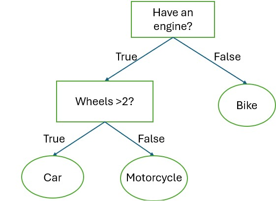
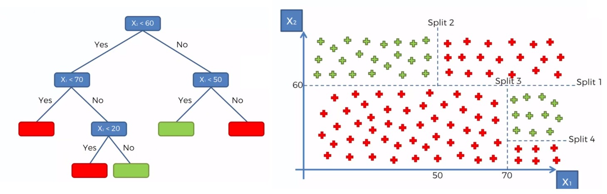

## What is a decision tree?

A Decision Tree is a popular and easy-to-understand algorithm used for classification and regression tasks.
Think of it like a flowchart that helps the computer make decisions by asking a series of yes/no questions about the data.



An example of a simple decision tree. Each root (rectangle) represents an input variable (x) and a condition of that variable.

Each leaf node (oval) represents an output variable (y) which is used to make a prediction.



## How does machine learning construct it?

The computer looks at all the data and tries to find the question that best splits the data into groups.
It keeps repeating this:

1. Find the best split point of each variable.
2. Split the data into branches.
3. Repeat for each branch

It stops when:

1. All the data in a branch belongs to the same category.
2. Or the tree reaches its maximum depth (to keep it simple).


## How Does a Decision Tree Decide the Best Way to Split the Data?

At each node of building a Decision Tree, the algorithm looks for the split point that splits the data into the most "pure" subsets. Ideally, after the split, all points in one branch belong to the same class. Since real-world data is messy, we aim to increase purity as much as possible.

## Impurity Measures
### 1. Gini Impurity *(default in scikit-learn)*
The formula for Gini impurity is:

$$
Gini = 1 - \sum_{i=1}^{n} p(i)^2
$$

Where:
- $p(i)$ is the proportion of class $i$ in the node.
- $n$ is the total number of classes.

The resulting Gini impurity ranges from [0,1), where:
- $Gini = 0$ indicates a perfectly pure node (all elements belong to the same class).
- For binary classification, $Gini = 0.5$ (maximum) indicates maximum impurity (elements are evenly distributed among all classes).
- For multi-class classification, $Gini$ can be higher than 0.5 but always less than 1.


### 2. Entropy

The formula for Entropy is:

$$
Entropy = - \sum_{i=1}^{n} p(i) \log_2 p(i)
$$

Where:
- $p(i)$ is the proportion of class $i$ in the node.
- $\log_2$ is the base-2 logarithm (used because we measure bits of information).

About the Entropy:
- $Entropy = 0$ occurs when all instances belong to a single class.
- For binary classification, max $Entropy$ is 1 when classes are evenly split (50%-50%).
- For multi-class classification, $Entropy$ increases (depends on number of classes).

### Gini vs Entropy

`"gini"` is much faster, whereas `"entropy"` does log calculation and is a more expensive computation. But sometimes with imbalanced classes, `"entropy"` performs better.

```{python}
#| code-fold: true
#| code-summary: "Show the code for Binary Classification: Gini vs Entropy"
#| warning: false

import numpy as np
import matplotlib.pyplot as plt

# Function to compute Gini
def gini(p):
    return 1 - np.sum(p**2, axis=0)

# Function to compute Entropy
def entropy(p):
    return -np.sum(np.where(p > 0, p * np.log2(p), 0), axis=0)

# Generate binary classification probabilities (2 classes)
p1 = np.linspace(0, 1, 100)
p_binary = np.array([p1, 1 - p1])

# Generate ternary classification probabilities (3 classes)
p_vals = np.linspace(0, 1, 100)
P1, P2 = np.meshgrid(p_vals, p_vals)

# Calculate impurity
gini_binary = gini(p_binary)
entropy_binary = entropy(p_binary)

# Plot binary classification
plt.figure(figsize=(12, 5))
plt.subplot(1, 2, 1)
plt.plot(p1, gini_binary, label="Gini impurity", color='red')
plt.plot(p1, entropy_binary, label="Entropy", color='blue')
plt.title("Binary Classification: Gini vs Entropy")
plt.xlabel("Probability of Class 1")
plt.ylabel("Impurity")
plt.legend()
plt.grid(True)

plt.tight_layout()
plt.show()
```


Scikit-learn also provides another measure `"log_loss"`, which uses log loss (better for probabilistic splits) <https://scikit-learn.org/stable/modules/generated/sklearn.tree.DecisionTreeClassifier.html>.
